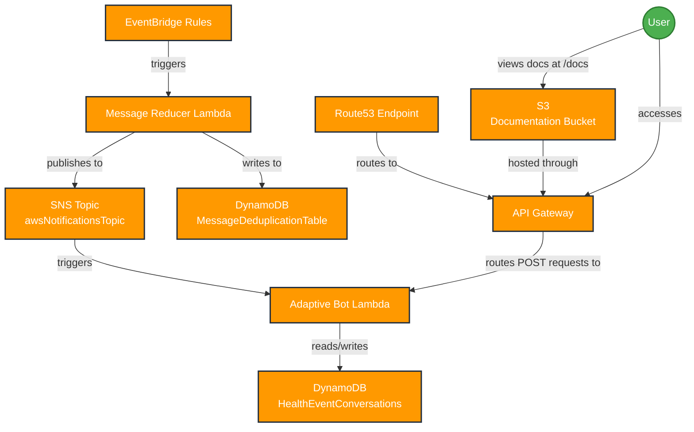

# AWS Bot Lambda

A serverless notification bot for AWS events that integrates with messaging platforms like Microsoft Teams and Slack. This solution processes AWS health events and service notifications, deduplicates them, and delivers them as rich interactive messages.

## Overview

This project implements a serverless architecture on AWS that:
- Processes AWS service events and notifications
- Deduplicates messages to prevent alert fatigue
- Delivers formatted notifications to messaging platforms
- Provides an API for both bot functionality and documentation

## Architecture

https://aws.amazon.com/blogs/security/how-to-set-up-amazon-cognito-for-federated-authentication-using-azure-ad/

The diagram below represents the infrastructure components and their relationships deployed by the CDK stack.



### Component Details

- **EventBridge Rules**: Trigger the MessageReducer lambda based on configured AWS service events
- **SNS Topic**: Central messaging service for health notifications with the name "awsNotificationsTopic"
- **DynamoDB Tables**:
  - **MessageDeduplicationTable**: Stores message IDs and timestamps to prevent duplicate processing
  - **HealthEventConversations**: Maintains conversation state for health events
- **Lambda Functions**:
  - **MessageReducer**: Processes incoming events, applies field removal rules, and deduplicates before publishing to SNS
  - **AdaptiveBot**: Processes notifications and manages conversations with the messaging platform
- **API Gateway**: Provides HTTP endpoints for both the bot and documentation access
- **Route53**: DNS configuration for the API Gateway
- **S3 Bucket**: Stores documentation assets accessible via the API Gateway's "/docs" endpoint

## Features

- **Event Processing**: Capture and process AWS health events and service notifications
- **Message Deduplication**: Prevent duplicate notifications for the same event
- **Adaptive Cards**: Rich, interactive message cards for better information display
- **Documentation Access**: Built-in documentation served through API Gateway
- **Conversation Management**: Maintain context for ongoing conversations about health events
- **Field Removal Rules**: Configurable rules to ignore non-essential fields for deduplication

## Setup

### Prerequisites

- AWS Account with appropriate permissions
- Node.js 14.x or later
- AWS CDK installed
- Messaging platform configured (Teams, Slack, etc.)

### Installation

1. Clone this repository:
   ```
   git clone https://github.com/yourusername/AWSBotLambda.git
   cd AWSBotLambda
   ```

2. Install dependencies:
   ```
   npm install
   ```

3. Configure AWS credentials:
   ```
   aws configure
   ```

4. Deploy the stack:
   ```
   npm run cdk deploy
   ```

5. Configure your messaging platform webhook using the generated API Gateway URL

## Configuration

### Event Mappings

Configure which events trigger notifications and which template to use in the configuration file:

```json
{
  "eventMappings": {
    "aws.ec2": "ec2-card",
    "aws.ssm": "ssm-card",
    "aws.cloudwatch": "cloudwatch-card",
    "default": "notification-default"
  },
  "fieldRemovalRules": {
    "aws.ssm": ["version", "id", "time"]
  }
}
```

## Documentation

In-depth documentation is available at the `/docs` endpoint of your API Gateway URL. This documentation includes:

- Detailed setup instructions
- API reference
- Custom Adaptive Card development
- Troubleshooting guides

## Development

### Project Structure

- `/AWS` - CDK infrastructure code
  - `/lib` - CDK constructs for different AWS services
  - `/bin` - CDK app entry point
- `/src` - Lambda function code
  - `/messageReducer` - Message processing and deduplication lambda
  - `/adaptiveBot` - Bot functionality and conversation management
- `/documentation` - Static documentation files
- `/adaptiveCards` - Adaptive Card templates

### Adding Custom Card Templates

1. Create your custom card template in `/adaptiveCards`
2. Register it in the card registry:

```typescript
// Add your custom card to the registry
const cardTemplates = {
  'notification-default': notificationDefault,
  'generic-card': genericCard,
  'ssm-card': ssmCard,
  'your-custom-card': yourCustomCardTemplate
};
```

## License

This project is licensed under the MIT License - see the LICENSE file for details.

## Contributing

Contributions are welcome! Please feel free to submit a Pull Request.
