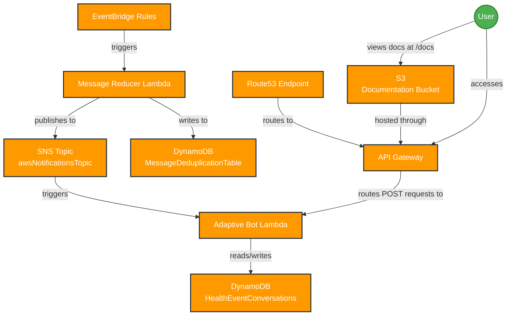

# AWS Bot Lambda Documentation

A comprehensive serverless notification bot for AWS events that integrates with messaging platforms like Microsoft Teams and Slack. This solution processes AWS health events and service notifications, deduplicates them, and delivers them as rich interactive messages.

## 📚 Documentation Index

- [🏗️ Architecture Overview](./architecture.md) - System architecture and component relationships
- [🚀 Setup & Installation](./setup.md) - Complete setup and installation guide
- [⚙️ Configuration](./configuration.md) - Configuration options and environment variables
- [🔌 API Reference](./api-reference.md) - Complete API documentation
- [🃏 Adaptive Cards](./adaptive-cards.md) - Adaptive cards templates and customization
- [🔗 Integrations](./integrations.md) - JIRA, Confluence, and PagerDuty integrations
- [🔐 Authentication](./authentication.md) - Cognito and Azure AD authentication setup
- [👩‍💻 Development Guide](./development.md) - Development setup and contribution guidelines
- [🛠️ Troubleshooting](./troubleshooting.md) - Common issues and solutions
- [🚢 Deployment](./deployment.md) - Deployment strategies and best practices

## 🌟 Key Features

- **Event Processing**: Capture and process AWS health events and service notifications
- **Message Deduplication**: Prevent duplicate notifications for the same event using intelligent deduplication
- **Adaptive Cards**: Rich, interactive message cards for better information display
- **Multi-Platform Support**: Teams, Slack, and other messaging platform integration
- **Authentication**: Secure authentication with Cognito and Azure AD integration
- **Documentation Access**: Built-in documentation served through API Gateway
- **Conversation Management**: Maintain context for ongoing conversations about health events
- **Field Removal Rules**: Configurable rules to ignore non-essential fields for deduplication
- **Cost Optimization**: Identify cost-saving opportunities in AWS resources
- **Security Compliance**: Check resources against AWS best practices

## 🏭 Architecture Overview

## 🚀 Quick Start

1. **Prerequisites**: Ensure you have AWS CLI, Node.js, and CDK installed
2. **Configuration**: Set up your environment variables
3. **Deploy**: Run `yarn cdk deploy` to deploy the infrastructure
4. **Configure Bot**: Set up your messaging platform webhook
5. **Test**: Send a test notification to verify functionality

For detailed instructions, see the [Setup Guide](./setup.md).

## 🤝 Support

For issues, questions, or contributions:
- Create an issue in the repository
- Review the [Troubleshooting Guide](./troubleshooting.md)
- Check the [Development Guide](./development.md) for contribution guidelines

## 📄 License

This project is licensed under the MIT License - see the LICENSE file for details.