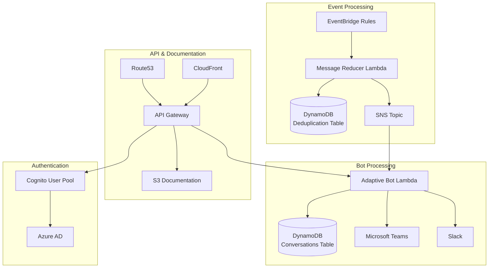

# 🏗️ Architecture Overview

## System Architecture

The AWS Bot Lambda implements a serverless event-driven architecture that processes AWS health events and delivers notifications through messaging platforms with intelligent deduplication and rich formatting.

## Infrastructure Components

### Core Processing Pipeline



### Component Details

#### **EventBridge Rules**
- **Purpose**: Capture AWS service events and health notifications
- **Trigger**: Configured patterns for specific AWS service events
- **Target**: Message Reducer Lambda function
- **Configuration**: Defined in `lib/eventBridge/rules.ts`

#### **Message Reducer Lambda**
- **Purpose**: Process incoming events, apply deduplication, and publish to SNS
- **Location**: `src/notifications/messageReducer.ts`
- **Key Features**:
  - Field removal rules for cleaner deduplication
  - Message hash generation for duplicate detection
  - Configurable retention periods
- **Database**: Writes to MessageDeduplicationTable

#### **SNS Topic (awsNotificationsTopic)**
- **Purpose**: Central messaging hub for processed notifications
- **Name**: `awsNotificationsTopic`
- **Subscribers**: Adaptive Bot Lambda function
- **Configuration**: Defined in `lib/sns/notificationsTopic.ts`

#### **Adaptive Bot Lambda**
- **Purpose**: Handle bot conversations and send adaptive cards
- **Location**: `src/adaptiveBot/adaptiveBot.ts`
- **Key Features**:
  - Adaptive card rendering
  - Conversation state management
  - Integration with external services (JIRA, PagerDuty, Confluence)
  - Multi-platform messaging support

#### **DynamoDB Tables**

##### MessageDeduplicationTable
- **Purpose**: Store message hashes and timestamps for deduplication
- **Schema**:
  ```typescript
  {
    messageId: string,      // Primary key
    timestamp: number,      // TTL for automatic cleanup
    eventHash: string,      // Hash of processed event
    processed: boolean      // Processing status
  }
  ```

##### HealthEventConversations
- **Purpose**: Maintain conversation state for ongoing health events
- **Schema**:
  ```typescript
  {
    conversationId: string,  // Primary key
    participants: string[],  // Conversation participants
    eventDetails: object,    // Original event information
    status: string,          // Conversation status
    lastUpdated: number      // Last update timestamp
  }
  ```

#### **API Gateway**
- **Purpose**: Provide HTTP endpoints for bot and documentation
- **Endpoints**:
  - `POST /` - Bot webhook endpoint
  - `GET /docs` - Documentation access
  - `GET /docs/*` - Documentation resources
- **Features**:
  - Request validation
  - CORS configuration
  - Custom authorizers
  - Logging and monitoring

#### **S3 Buckets**

##### Documentation Bucket
- **Purpose**: Host static documentation files
- **Content**: Built from `documentation/src/` directory
- **Access**: Through API Gateway `/docs` endpoint
- **Security**: Private bucket with IAM role access

##### Assets Bucket
- **Purpose**: Host static assets (CSS, JS, images)
- **Content**: Built from `documentationAssets/src/` directory
- **Access**: Through CloudFront distribution

#### **CloudFront Distribution**
- **Purpose**: Content delivery and caching for documentation and assets
- **Features**:
  - Global content distribution
  - HTTPS enforcement
  - Custom domain support
  - Edge authentication

#### **Route53**
- **Purpose**: DNS management for custom domain
- **Configuration**: Points to CloudFront distribution
- **SSL**: Uses ACM certificates for HTTPS

#### **Cognito User Pool**
- **Purpose**: Authentication and authorization
- **Provider**: Azure AD federation
- **Features**:
  - SAML 2.0 integration
  - Group-based access control
  - JWT token generation

## Data Flow

### Event Processing Flow

1. **Event Capture**: EventBridge rules capture AWS service events
2. **Processing**: Message Reducer Lambda processes events:
   - Applies field removal rules
   - Generates message hash
   - Checks for duplicates in DynamoDB
   - Publishes unique events to SNS
3. **Notification**: SNS triggers Adaptive Bot Lambda
4. **Delivery**: Bot formats and sends notifications to messaging platforms

### Documentation Access Flow

1. **Request**: User accesses `/docs` endpoint
2. **Routing**: Route53 → CloudFront → API Gateway
3. **Authentication**: Cognito validates user (if configured)
4. **Content**: API Gateway fetches content from S3
5. **Response**: Documentation served to user

### Bot Interaction Flow

1. **Webhook**: Messaging platform sends POST to API Gateway
2. **Processing**: Adaptive Bot Lambda processes the request:
   - Validates webhook signature
   - Processes bot commands
   - Updates conversation state in DynamoDB
   - Integrates with external services if needed
3. **Response**: Bot sends formatted response to messaging platform

## Security Model

### Network Security
- **Private Subnets**: Lambda functions in private subnets
- **VPC Endpoints**: Secure access to AWS services
- **Security Groups**: Restrictive inbound/outbound rules

### Authentication & Authorization
- **Cognito**: Centralized authentication
- **Azure AD**: Corporate identity integration
- **IAM Roles**: Least privilege access
- **API Keys**: Optional API Gateway authentication

### Data Protection
- **Encryption**: At-rest and in-transit encryption
- **Private Buckets**: No public S3 access
- **Secrets**: AWS Secrets Manager or SSM Parameter Store

## Monitoring & Observability

### CloudWatch Integration
- **Logs**: Structured logging from all Lambda functions
- **Metrics**: Custom metrics for deduplication and processing
- **Alarms**: Automated alerting for failures

### X-Ray Tracing
- **Distributed Tracing**: End-to-end request tracing
- **Performance**: Identify bottlenecks and optimization opportunities

## Scalability Considerations

### Auto-scaling
- **Lambda**: Automatic scaling based on request volume
- **DynamoDB**: On-demand billing with automatic scaling
- **API Gateway**: Built-in scaling and throttling

### Performance Optimization
- **Connection Pooling**: Reuse database connections
- **Caching**: CloudFront caching for static content
- **Compression**: GZIP compression for API responses

## High Availability

### Multi-AZ Deployment
- **DynamoDB**: Multi-AZ replication
- **Lambda**: Automatic multi-AZ execution
- **S3**: 99.999999999% durability

### Disaster Recovery
- **Backup**: Automated DynamoDB backups
- **Infrastructure as Code**: CDK for reproducible deployments
- **Cross-Region**: Optional cross-region replication