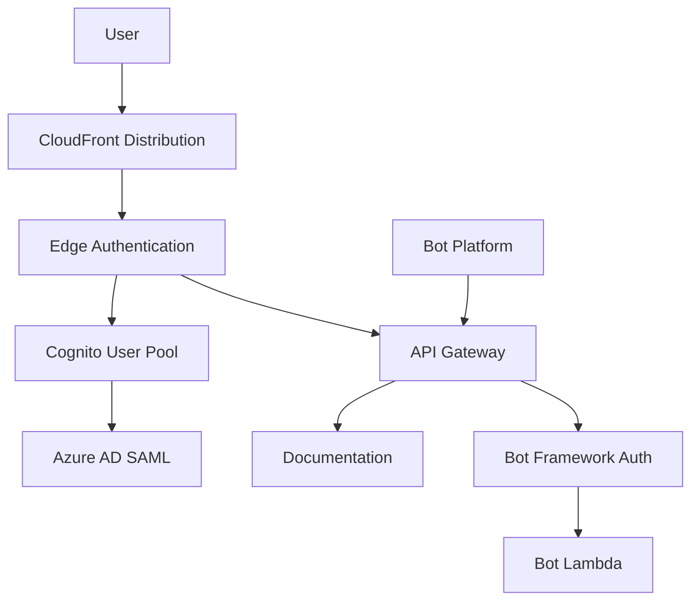

# 🔐 Authentication Guide

## Overview

AWS Bot Lambda supports multiple authentication mechanisms to secure access to the bot interface and documentation. The primary authentication method uses Amazon Cognito with Azure AD federation for enterprise SSO.

## Authentication Architecture



## Cognito User Pool Setup

### Overview

Amazon Cognito provides the authentication layer with support for:
- Azure AD SAML federation
- JWT token generation
- Group-based access control
- Custom authentication flows

### Configuration

#### 1. Environment Variables

```bash
# Cognito Configuration
COGNITO_USER_POOL_NAME=aws-bot-pool
COGNITO_USER_POOL_CLIENT_NAME=AzureADClient
COGNITO_USER_POOL_DOMAIN=aws-bot-auth
COGNITO_CLIENT_ID=generated-by-cognito
COGNITO_AWS_REGION=us-east-1
COGNITO_PROVIDER_NAME=AzureAD
COGNITO_AZURE_CALLBACK_URL=callback
COGNITO_LOGOUT_URL=logout.html

# Azure AD Federation
COGNITO_AZURE_TENANT_ID=12345678-1234-1234-1234-123456789012
COGNITO_AZURE_CLIENT_ID=87654321-4321-4321-4321-210987654321
COGNITO_AZURE_CLIENT_SECRET=your-client-secret
COGNITO_AZURE_GROUP_ID=authorized-group-id
```

#### 2. User Pool Configuration

The Cognito User Pool is configured with:

```typescript
// In lib/cognito/cognitoAuth.ts
const userPool = new cognito.UserPool(this, 'BotUserPool', {
  userPoolName: props.userPoolName,
  signInAliases: {
    email: true,
    username: false
  },
  passwordPolicy: {
    minLength: 8,
    requireLowercase: true,
    requireUppercase: true,
    requireDigits: true,
    requireSymbols: false
  },
  mfa: cognito.Mfa.OPTIONAL,
  mfaSecondFactor: {
    sms: true,
    otp: true
  }
});
```

#### 3. SAML Identity Provider

```typescript
const samlProvider = new cognito.UserPoolIdentityProviderSaml(this, 'AzureADProvider', {
  userPool: userPool,
  name: 'AzureAD',
  metadata: cognito.UserPoolIdentityProviderSamlMetadata.url(
    `https://login.microsoftonline.com/${props.azureTenantId}/federationmetadata/2007-06/federationmetadata.xml`
  ),
  attributeMapping: {
    email: cognito.ProviderAttribute.other('http://schemas.xmlsoap.org/ws/2005/05/identity/claims/emailaddress'),
    familyName: cognito.ProviderAttribute.other('http://schemas.xmlsoap.org/ws/2005/05/identity/claims/surname'),
    givenName: cognito.ProviderAttribute.other('http://schemas.xmlsoap.org/ws/2005/05/identity/claims/givenname'),
    groups: cognito.ProviderAttribute.other('http://schemas.microsoft.com/ws/2008/06/identity/claims/groups')
  }
});
```

### Authentication Flow

#### 1. User Access Flow

1. **User Request**: User accesses documentation at `/docs`
2. **CloudFront**: Request hits CloudFront distribution
3. **Edge Function**: Lambda@Edge function checks authentication
4. **Redirect**: If not authenticated, redirect to Cognito login
5. **Azure AD**: User authenticates with corporate credentials
6. **Token Generation**: Cognito generates JWT tokens
7. **Access Granted**: User can access protected resources

#### 2. JWT Token Structure

```json
{
  "header": {
    "alg": "RS256",
    "kid": "key-id"
  },
  "payload": {
    "sub": "user-uuid",
    "aud": "cognito-client-id",
    "iss": "https://cognito-idp.region.amazonaws.com/userPoolId",
    "exp": 1640995200,
    "iat": 1640991600,
    "auth_time": 1640991600,
    "token_use": "id",
    "email": "user@company.com",
    "cognito:groups": ["AWS-Users", "Documentation-Readers"],
    "custom:azure_groups": "group1,group2"
  }
}
```

## Azure AD Integration

### Prerequisites

- Azure AD Premium P1 or P2 license
- Global Administrator role
- Enterprise Application registration permissions

### Setup Steps

#### 1. Register Enterprise Application

1. Navigate to Azure AD → Enterprise Applications
2. Click "New application"
3. Select "Create your own application"
4. Choose "Integrate any other application (Non-gallery)"
5. Provide application name: "AWS Bot Lambda"

#### 2. Configure Single Sign-On

1. Go to Single Sign-On settings
2. Select "SAML" as the method
3. Configure Basic SAML Configuration:

```xml
<!-- Identifier (Entity ID) -->
urn:amazon:cognito:sp:${userPoolId}

<!-- Reply URL (Assertion Consumer Service URL) -->
https://${domain}.auth.${region}.amazoncognito.com/saml2/idpresponse

<!-- Sign on URL -->
https://${domain}.auth.${region}.amazoncognito.com/login?client_id=${clientId}&response_type=code&redirect_uri=${redirectUri}

<!-- Logout URL -->
https://${domain}.auth.${region}.amazoncognito.com/logout
```

#### 3. Configure Claims

Add the following claims in "User Attributes & Claims":

```xml
<!-- Required Claims -->
<saml2:Attribute Name="http://schemas.xmlsoap.org/ws/2005/05/identity/claims/emailaddress">
  <saml2:AttributeValue>user.mail</saml2:AttributeValue>
</saml2:Attribute>

<saml2:Attribute Name="http://schemas.xmlsoap.org/ws/2005/05/identity/claims/givenname">
  <saml2:AttributeValue>user.givenname</saml2:AttributeValue>
</saml2:Attribute>

<saml2:Attribute Name="http://schemas.xmlsoap.org/ws/2005/05/identity/claims/surname">
  <saml2:AttributeValue>user.surname</saml2:AttributeValue>
</saml2:Attribute>

<!-- Optional: Group Claims -->
<saml2:Attribute Name="http://schemas.microsoft.com/ws/2008/06/identity/claims/groups">
  <saml2:AttributeValue>user.groups</saml2:AttributeValue>
</saml2:Attribute>
```

#### 4. Assign Users and Groups

1. Go to "Users and groups"
2. Click "Add user/group"
3. Select users or groups to grant access
4. Assign appropriate roles

### Group-Based Access Control

#### 1. Configure Groups

Map Azure AD groups to application permissions:

```typescript
const groupPermissions = {
  'AWS-Administrators': {
    permissions: ['admin', 'create', 'read', 'update', 'delete'],
    resources: ['*']
  },
  'AWS-Users': {
    permissions: ['create', 'read', 'update'],
    resources: ['jira', 'confluence', 'pagerduty']
  },
  'AWS-Viewers': {
    permissions: ['read'],
    resources: ['documentation', 'status']
  }
};
```

#### 2. Authorization Logic

```typescript
const checkPermissions = (userGroups: string[], requiredPermission: string, resource: string): boolean => {
  return userGroups.some(group => {
    const permissions = groupPermissions[group];
    return permissions && 
           permissions.permissions.includes(requiredPermission) &&
           (permissions.resources.includes('*') || permissions.resources.includes(resource));
  });
};
```

## Edge Authentication

### Lambda@Edge Function

The edge authentication function runs at CloudFront edge locations to validate JWT tokens:

```typescript
// In lib/cloudfrontEdgeFunction/authFunction.ts
export const handler = async (event: CloudFrontRequestEvent): Promise<CloudFrontRequest | CloudFrontResponse> => {
  const request = event.Records[0].cf.request;
  const headers = request.headers;
  
  // Check for authentication cookie
  const authCookie = getCookie(headers, 'AWSBotAuth');
  
  if (!authCookie) {
    return redirectToLogin(request);
  }
  
  try {
    // Verify JWT token
    const decoded = jwt.verify(authCookie, getPublicKey());
    
    // Check token expiration
    if (decoded.exp < Date.now() / 1000) {
      return redirectToLogin(request);
    }
    
    // Check required groups
    if (!hasRequiredPermissions(decoded.groups)) {
      return accessDeniedResponse();
    }
    
    // Add user context to request
    request.headers['x-user-id'] = [{ key: 'X-User-ID', value: decoded.sub }];
    request.headers['x-user-groups'] = [{ key: 'X-User-Groups', value: decoded.groups.join(',') }];
    
    return request;
  } catch (error) {
    console.error('Token verification failed:', error);
    return redirectToLogin(request);
  }
};
```

### Cookie Management

```typescript
const setCookie = (response: CloudFrontResponse, name: string, value: string, maxAge: number): void => {
  const cookie = `${name}=${value}; Path=/; Secure; HttpOnly; SameSite=Strict; Max-Age=${maxAge}`;
  
  if (!response.headers['set-cookie']) {
    response.headers['set-cookie'] = [];
  }
  
  response.headers['set-cookie'].push({
    key: 'Set-Cookie',
    value: cookie
  });
};
```

## Bot Framework Authentication

### Microsoft Bot Framework

For Microsoft Teams integration, the Bot Framework handles authentication:

```typescript
// In src/adaptiveBot/lib/getBotToken.ts
const getBotAccessToken = async (): Promise<string> => {
  const tokenEndpoint = 'https://login.microsoftonline.com/botframework.com/oauth2/v2.0/token';
  
  const params = new URLSearchParams({
    grant_type: 'client_credentials',
    client_id: process.env.BOT_ID!,
    client_secret: process.env.BOT_PASSWORD!,
    scope: 'https://api.botframework.com/.default'
  });
  
  const response = await fetch(tokenEndpoint, {
    method: 'POST',
    headers: { 'Content-Type': 'application/x-www-form-urlencoded' },
    body: params
  });
  
  const data = await response.json();
  return data.access_token;
};
```

### Webhook Signature Verification

```typescript
const verifySignature = (request: APIGatewayProxyEvent): boolean => {
  const signature = request.headers['Authorization'];
  const body = request.body;
  
  if (!signature || !signature.startsWith('Bearer ')) {
    return false;
  }
  
  const token = signature.substring(7);
  
  try {
    // Verify JWT token from Bot Framework
    const decoded = jwt.verify(token, getBotFrameworkPublicKey(), {
      issuer: 'https://api.botframework.com',
      audience: process.env.BOT_ID
    });
    
    return true;
  } catch (error) {
    console.error('Signature verification failed:', error);
    return false;
  }
};
```

## Security Best Practices

### Token Management

#### 1. Secure Storage

- Use HttpOnly cookies for web authentication
- Implement secure token refresh mechanisms
- Set appropriate token expiration times

#### 2. Token Rotation

```typescript
const refreshToken = async (refreshToken: string): Promise<AuthTokens> => {
  const response = await fetch(`${cognitoDomain}/oauth2/token`, {
    method: 'POST',
    headers: { 'Content-Type': 'application/x-www-form-urlencoded' },
    body: new URLSearchParams({
      grant_type: 'refresh_token',
      refresh_token: refreshToken,
      client_id: process.env.COGNITO_CLIENT_ID!
    })
  });
  
  const data = await response.json();
  return {
    accessToken: data.access_token,
    idToken: data.id_token,
    refreshToken: data.refresh_token,
    expiresIn: data.expires_in
  };
};
```

### Access Control

#### 1. Principle of Least Privilege

- Grant minimum required permissions
- Use resource-specific access controls
- Implement time-based access restrictions

#### 2. Audit Logging

```typescript
const logAccess = (userId: string, resource: string, action: string, result: 'success' | 'denied'): void => {
  console.log(JSON.stringify({
    timestamp: new Date().toISOString(),
    userId,
    resource,
    action,
    result,
    userAgent: request.headers['User-Agent'],
    ip: request.requestContext.identity.sourceIp
  }));
};
```

## Troubleshooting

### Common Issues

#### 1. SAML Configuration Errors

**Symptoms:**
- Users can't authenticate with Azure AD
- SAML assertion errors in Cognito logs

**Solutions:**
- Verify Entity ID matches exactly
- Check Reply URL configuration
- Validate claim mappings
- Test with SAML tracer

#### 2. JWT Token Verification Failures

**Symptoms:**
- Edge function returns 401 errors
- Users redirected to login repeatedly

**Solutions:**
- Check public key rotation
- Verify token signature algorithm
- Validate token audience and issuer
- Check system clock synchronization

#### 3. Group Mapping Issues

**Symptoms:**
- Users have incorrect permissions
- Group claims not appearing in tokens

**Solutions:**
- Verify Azure AD group claim configuration
- Check Cognito attribute mapping
- Test group membership in Azure AD
- Review group permission logic

### Debugging Tools

#### 1. CloudWatch Logs

Monitor authentication events:

```bash
aws logs filter-log-events \
  --log-group-name "/aws/lambda/edge/auth-function" \
  --start-time $(date -d '1 hour ago' +%s)000 \
  --filter-pattern "ERROR"
```

#### 2. JWT Debugging

Use online JWT decoders to inspect tokens:
- [jwt.io](https://jwt.io)
- Verify signature with Cognito public keys
- Check claim values and expiration

#### 3. SAML Debugging

Use browser tools to inspect SAML flow:
- SAML Tracer browser extension
- Network tab in developer tools
- Azure AD sign-in logs

### Support Resources

- [Amazon Cognito Documentation](https://docs.aws.amazon.com/cognito/)
- [Azure AD SAML Configuration](https://docs.microsoft.com/en-us/azure/active-directory/saas-apps/)
- [Microsoft Bot Framework Authentication](https://docs.microsoft.com/en-us/azure/bot-service/bot-builder-authentication)
- [Lambda@Edge Documentation](https://docs.aws.amazon.com/lambda/latest/dg/lambda-edge.html)

For deployment configuration, see the [Deployment Guide](./deployment.md).