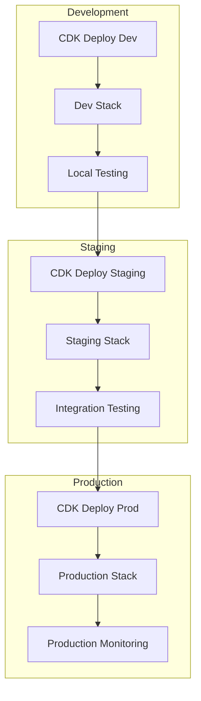

# 🚢 Deployment Guide

## Overview

This guide covers deployment strategies, environment management, and best practices for deploying AWS Bot Lambda across different environments (development, staging, production).

## Deployment Architecture

### Multi-Environment Strategy



## Environment Configuration

### Environment-Specific Settings

#### Development Environment

```typescript
// config/dev.ts
export const devConfig = {
  environment: 'development',
  stackName: 'aws-bot-dev',
  
  // Relaxed security for development
  authentication: {
    enabled: false,
    cognitoRequired: false
  },
  
  // Minimal resources
  lambda: {
    memorySize: 256,
    timeout: 30,
    reservedConcurrency: 5
  },
  
  // Development endpoints
  api: {
    domainName: 'api-dev.example.com',
    throttling: {
      burstLimit: 100,
      rateLimit: 50
    }
  },
  
  // Mock external services
  integrations: {
    jira: {
      baseUrl: 'https://mock-jira.example.com',
      mockResponses: true
    },
    pagerduty: {
      mockResponses: true
    }
  }
};
```

#### Staging Environment

```typescript
// config/staging.ts
export const stagingConfig = {
  environment: 'staging',
  stackName: 'aws-bot-staging',
  
  // Production-like security
  authentication: {
    enabled: true,
    cognitoRequired: true,
    allowedGroups: ['AWS-Staging-Users']
  },
  
  // Production-like resources
  lambda: {
    memorySize: 512,
    timeout: 60,
    reservedConcurrency: 10
  },
  
  // Staging endpoints
  api: {
    domainName: 'api-staging.example.com',
    throttling: {
      burstLimit: 200,
      rateLimit: 100
    }
  },
  
  // Real integrations with test accounts
  integrations: {
    jira: {
      baseUrl: 'https://staging.atlassian.net',
      mockResponses: false
    }
  }
};
```

#### Production Environment

```typescript
// config/prod.ts
export const prodConfig = {
  environment: 'production',
  stackName: 'aws-bot-prod',
  
  // Full security
  authentication: {
    enabled: true,
    cognitoRequired: true,
    allowedGroups: ['AWS-Production-Users', 'AWS-Admins'],
    mfaRequired: true
  },
  
  // Production resources
  lambda: {
    memorySize: 1024,
    timeout: 90,
    reservedConcurrency: 50,
    provisionedConcurrency: 10
  },
  
  // Production endpoints
  api: {
    domainName: 'api.example.com',
    throttling: {
      burstLimit: 1000,
      rateLimit: 500
    }
  },
  
  // Production integrations
  integrations: {
    jira: {
      baseUrl: 'https://company.atlassian.net',
      mockResponses: false
    },
    pagerduty: {
      mockResponses: false
    }
  },
  
  // Enhanced monitoring
  monitoring: {
    detailedMetrics: true,
    xrayTracing: true,
    alarmNotifications: true
  }
};
```

### Configuration Management

#### Environment Variables by Stage

```bash
# Development (.env.dev)
NODE_ENV=development
LOG_LEVEL=debug
BOT_ID=dev-bot-id
JIRA_BASE_URL=https://staging.atlassian.net
MOCK_EXTERNAL_APIS=true

# Staging (.env.staging)
NODE_ENV=staging
LOG_LEVEL=info
BOT_ID=staging-bot-id
JIRA_BASE_URL=https://staging.atlassian.net
MOCK_EXTERNAL_APIS=false

# Production (.env.prod)
NODE_ENV=production
LOG_LEVEL=warn
BOT_ID=prod-bot-id
JIRA_BASE_URL=https://company.atlassian.net
MOCK_EXTERNAL_APIS=false
```

#### CDK Context Configuration

```json
// cdk.context.json
{
  "environments": {
    "dev": {
      "account": "111111111111",
      "region": "us-east-1",
      "domainName": "dev.example.com"
    },
    "staging": {
      "account": "222222222222", 
      "region": "us-east-1",
      "domainName": "staging.example.com"
    },
    "prod": {
      "account": "333333333333",
      "region": "us-east-1",
      "domainName": "example.com"
    }
  }
}
```

## Deployment Procedures

### Prerequisites Checklist

#### AWS Account Setup

- [ ] AWS accounts configured for each environment
- [ ] Cross-account IAM roles configured
- [ ] AWS CLI credentials configured
- [ ] CDK bootstrap completed for each account/region
- [ ] Domain names and SSL certificates ready
- [ ] Route53 hosted zones configured

#### External Services

- [ ] Microsoft Bot Framework registration
- [ ] Azure AD application registration
- [ ] JIRA/Confluence API tokens
- [ ] PagerDuty API keys
- [ ] Slack/Teams webhook URLs

### Deployment Commands

#### Development Deployment

```bash
# Set environment
export AWS_PROFILE=dev-profile
export NODE_ENV=development

# Load development environment
cp .env.dev .env

# Build and deploy
yarn build
cd AWS
yarn cdk deploy --context environment=dev

# Verify deployment
curl -f https://api-dev.example.com/health
```

#### Staging Deployment

```bash
# Set environment
export AWS_PROFILE=staging-profile
export NODE_ENV=staging

# Load staging environment
cp .env.staging .env

# Build and test
yarn build
yarn test

# Deploy with approval
cd AWS
yarn cdk deploy --context environment=staging --require-approval broadening

# Run integration tests
yarn test:integration --env=staging
```

#### Production Deployment

```bash
# Set environment
export AWS_PROFILE=prod-profile
export NODE_ENV=production

# Load production environment
cp .env.prod .env

# Full test suite
yarn build
yarn test
yarn test:integration
yarn test:e2e

# Create backup (if needed)
aws cloudformation describe-stacks --stack-name aws-bot-prod > backup-$(date +%Y%m%d).json

# Deploy with manual approval
cd AWS
yarn cdk deploy --context environment=prod --require-approval never

# Smoke tests
yarn test:smoke --env=production
```

### Automated Deployment Pipeline

#### GitHub Actions Workflow

```yaml
# .github/workflows/deploy.yml
name: Deploy to AWS

on:
  push:
    branches: [main, develop]
  pull_request:
    branches: [main]

env:
  AWS_REGION: us-east-1

jobs:
  test:
    runs-on: ubuntu-latest
    steps:
      - uses: actions/checkout@v3
      
      - name: Setup Node.js
        uses: actions/setup-node@v3
        with:
          node-version: '18'
          cache: 'yarn'
      
      - name: Install dependencies
        run: yarn install --frozen-lockfile
      
      - name: Run tests
        run: |
          yarn lint
          yarn test --coverage
      
      - name: Build project
        run: yarn build

  deploy-dev:
    runs-on: ubuntu-latest
    needs: test
    if: github.ref == 'refs/heads/develop'
    environment: development
    
    steps:
      - uses: actions/checkout@v3
      
      - name: Configure AWS credentials
        uses: aws-actions/configure-aws-credentials@v2
        with:
          aws-access-key-id: ${{ secrets.DEV_AWS_ACCESS_KEY_ID }}
          aws-secret-access-key: ${{ secrets.DEV_AWS_SECRET_ACCESS_KEY }}
          aws-region: ${{ env.AWS_REGION }}
      
      - name: Deploy to Development
        run: |
          cd AWS
          yarn install
          yarn cdk deploy --context environment=dev --require-approval never

  deploy-staging:
    runs-on: ubuntu-latest
    needs: test
    if: github.ref == 'refs/heads/main'
    environment: staging
    
    steps:
      - uses: actions/checkout@v3
      
      - name: Configure AWS credentials
        uses: aws-actions/configure-aws-credentials@v2
        with:
          aws-access-key-id: ${{ secrets.STAGING_AWS_ACCESS_KEY_ID }}
          aws-secret-access-key: ${{ secrets.STAGING_AWS_SECRET_ACCESS_KEY }}
          aws-region: ${{ env.AWS_REGION }}
      
      - name: Deploy to Staging
        run: |
          cd AWS
          yarn install
          yarn cdk deploy --context environment=staging --require-approval never
      
      - name: Run integration tests
        run: yarn test:integration --env=staging

  deploy-prod:
    runs-on: ubuntu-latest
    needs: deploy-staging
    if: github.ref == 'refs/heads/main' && contains(github.event.head_commit.message, '[deploy-prod]')
    environment: production
    
    steps:
      - uses: actions/checkout@v3
      
      - name: Configure AWS credentials
        uses: aws-actions/configure-aws-credentials@v2
        with:
          aws-access-key-id: ${{ secrets.PROD_AWS_ACCESS_KEY_ID }}
          aws-secret-access-key: ${{ secrets.PROD_AWS_SECRET_ACCESS_KEY }}
          aws-region: ${{ env.AWS_REGION }}
      
      - name: Deploy to Production
        run: |
          cd AWS
          yarn install
          yarn cdk deploy --context environment=prod --require-approval never
      
      - name: Run smoke tests
        run: yarn test:smoke --env=production
```

## Security Considerations

### IAM Roles and Policies

#### Deployment Role

```typescript
// Minimal deployment permissions
const deploymentRole = new iam.Role(this, 'DeploymentRole', {
  assumedBy: new iam.ServicePrincipal('codebuild.amazonaws.com'),
  managedPolicies: [
    iam.ManagedPolicy.fromAwsManagedPolicyName('AWSCloudFormationFullAccess'),
    iam.ManagedPolicy.fromAwsManagedPolicyName('IAMFullAccess'),
    iam.ManagedPolicy.fromAwsManagedPolicyName('AWSLambdaFullAccess'),
    iam.ManagedPolicy.fromAwsManagedPolicyName('AmazonAPIGatewayAdministrator')
  ],
  inlinePolicies: {
    S3Access: new iam.PolicyDocument({
      statements: [
        new iam.PolicyStatement({
          effect: iam.Effect.ALLOW,
          actions: ['s3:*'],
          resources: ['arn:aws:s3:::cdk-*', 'arn:aws:s3:::cdk-*/*']
        })
      ]
    })
  }
});
```

#### Cross-Account Access

```typescript
// Cross-account deployment role
const crossAccountRole = new iam.Role(this, 'CrossAccountDeployRole', {
  assumedBy: new iam.ArnPrincipal('arn:aws:iam::CICD-ACCOUNT:root'),
  externalIds: ['unique-external-id'],
  managedPolicies: [
    iam.ManagedPolicy.fromAwsManagedPolicyName('PowerUserAccess')
  ],
  inlinePolicies: {
    DenyDangerousActions: new iam.PolicyDocument({
      statements: [
        new iam.PolicyStatement({
          effect: iam.Effect.DENY,
          actions: [
            'iam:CreateRole',
            'iam:DeleteRole',
            'iam:CreateUser',
            'iam:DeleteUser'
          ],
          resources: ['*'],
          conditions: {
            StringNotEquals: {
              'aws:PrincipalTag/Environment': props.environment
            }
          }
        })
      ]
    })
  }
});
```

### Secrets Management

#### AWS Secrets Manager

```typescript
// Store sensitive configuration
const secrets = new secretsmanager.Secret(this, 'BotSecrets', {
  secretName: `aws-bot-${props.environment}-secrets`,
  description: 'Sensitive configuration for AWS Bot Lambda',
  generateSecretString: {
    secretStringTemplate: JSON.stringify({
      botPassword: '',
      jiraApiToken: '',
      pagerDutyApiKey: ''
    }),
    generateStringKey: 'generatedSecret',
    excludeCharacters: '"@/\\'
  }
});

// Grant Lambda access to secrets
secrets.grantRead(lambdaFunction);
```

#### SSM Parameter Store

```typescript
// Store non-sensitive configuration
const parameters = {
  botId: new ssm.StringParameter(this, 'BotId', {
    parameterName: `/aws-bot/${props.environment}/bot-id`,
    stringValue: props.botId
  }),
  
  jiraBaseUrl: new ssm.StringParameter(this, 'JiraBaseUrl', {
    parameterName: `/aws-bot/${props.environment}/jira-base-url`,
    stringValue: props.jiraBaseUrl
  })
};
```

## Monitoring and Observability

### CloudWatch Setup

#### Dashboards

```typescript
// Create environment-specific dashboard
const dashboard = new cloudwatch.Dashboard(this, 'BotDashboard', {
  dashboardName: `aws-bot-${props.environment}`,
  widgets: [
    [
      // Lambda metrics
      new cloudwatch.GraphWidget({
        title: 'Lambda Invocations',
        left: [lambdaFunction.metricInvocations()],
        right: [lambdaFunction.metricErrors()]
      }),
      
      // API Gateway metrics
      new cloudwatch.GraphWidget({
        title: 'API Gateway Requests',
        left: [api.metricCount()],
        right: [api.metricLatency()]
      })
    ],
    [
      // DynamoDB metrics
      new cloudwatch.GraphWidget({
        title: 'DynamoDB Operations',
        left: [table.metricConsumedReadCapacityUnits()],
        right: [table.metricConsumedWriteCapacityUnits()]
      }),
      
      // Custom business metrics
      new cloudwatch.GraphWidget({
        title: 'Messages Processed',
        left: [
          new cloudwatch.Metric({
            namespace: 'AWSBot',
            metricName: 'MessagesProcessed',
            statistic: 'Sum'
          })
        ]
      })
    ]
  ]
});
```

#### Alarms

```typescript
// Environment-specific alarm thresholds
const alarmThresholds = {
  development: {
    errorRate: 10, // 10% error rate acceptable in dev
    latency: 10000 // 10 second timeout
  },
  staging: {
    errorRate: 5,
    latency: 5000
  },
  production: {
    errorRate: 1, // 1% error rate
    latency: 3000 // 3 second max latency
  }
};

const errorAlarm = new cloudwatch.Alarm(this, 'ErrorRateAlarm', {
  metric: lambdaFunction.metricErrors(),
  threshold: alarmThresholds[props.environment].errorRate,
  evaluationPeriods: 2,
  treatMissingData: cloudwatch.TreatMissingData.NOT_BREACHING
});

// Production-only notifications
if (props.environment === 'production') {
  errorAlarm.addAlarmAction(
    new cloudwatchActions.SnsAction(alertTopic)
  );
}
```

### Application Performance Monitoring

#### X-Ray Tracing

```typescript
// Enable X-Ray tracing in production
const tracingConfig = {
  development: lambda.Tracing.PASS_THROUGH,
  staging: lambda.Tracing.ACTIVE,
  production: lambda.Tracing.ACTIVE
};

new lambda.Function(this, 'TracedFunction', {
  tracing: tracingConfig[props.environment],
  environment: {
    _X_AMZN_TRACE_ID: props.environment === 'production' ? 'true' : 'false'
  }
});
```

#### Custom Metrics

```javascript
// Enhanced metrics for production
const publishMetrics = async (environment, metricName, value, unit = 'Count') => {
  if (environment === 'production' || environment === 'staging') {
    await cloudwatch.putMetricData({
      Namespace: `AWSBot/${environment}`,
      MetricData: [{
        MetricName: metricName,
        Value: value,
        Unit: unit,
        Dimensions: [
          { Name: 'Environment', Value: environment },
          { Name: 'Service', Value: 'AdaptiveBot' }
        ]
      }]
    }).promise();
  }
};
```

## Database Migration

### DynamoDB Schema Evolution

#### Migration Strategy

```typescript
// Versioned table schema
interface TableSchemaV1 {
  messageId: string;
  timestamp: number;
  processed: boolean;
}

interface TableSchemaV2 extends TableSchemaV1 {
  eventSource: string;
  retryCount: number;
}

// Migration Lambda
const migrationFunction = new lambda.Function(this, 'MigrationFunction', {
  runtime: lambda.Runtime.NODEJS_18_X,
  handler: 'migration.handler',
  code: lambda.Code.fromAsset('src/migration'),
  timeout: cdk.Duration.minutes(15),
  environment: {
    TABLE_NAME: table.tableName,
    MIGRATION_VERSION: '2'
  }
});
```

#### Migration Script

```javascript
// src/migration/migration.js
const AWS = require('aws-sdk');
const dynamodb = new AWS.DynamoDB.DocumentClient();

exports.handler = async (event) => {
  const tableName = process.env.TABLE_NAME;
  const migrationVersion = process.env.MIGRATION_VERSION;
  
  let lastEvaluatedKey;
  let processedItems = 0;
  
  do {
    const params = {
      TableName: tableName,
      Limit: 100,
      ExclusiveStartKey: lastEvaluatedKey
    };
    
    const result = await dynamodb.scan(params).promise();
    
    for (const item of result.Items) {
      if (!item.version || item.version < migrationVersion) {
        // Apply migration
        const updatedItem = {
          ...item,
          eventSource: item.eventSource || 'unknown',
          retryCount: item.retryCount || 0,
          version: migrationVersion
        };
        
        await dynamodb.put({
          TableName: tableName,
          Item: updatedItem
        }).promise();
        
        processedItems++;
      }
    }
    
    lastEvaluatedKey = result.LastEvaluatedKey;
  } while (lastEvaluatedKey);
  
  return {
    statusCode: 200,
    body: JSON.stringify({
      message: `Migration completed. Processed ${processedItems} items.`,
      version: migrationVersion
    })
  };
};
```

## Rollback Procedures

### Quick Rollback

```bash
# Emergency rollback to previous version
aws lambda update-function-code \
  --function-name your-function-name \
  --s3-bucket your-deployment-bucket \
  --s3-key previous-version.zip

# Rollback entire stack
cdk deploy --parameters PreviousVersion=1.2.3
```

### Blue-Green Deployment

```typescript
// Blue-green deployment with aliases
const blueAlias = new lambda.Alias(this, 'BlueAlias', {
  aliasName: 'blue',
  version: lambdaFunction.currentVersion
});

const greenAlias = new lambda.Alias(this, 'GreenAlias', {
  aliasName: 'green', 
  version: lambdaFunction.currentVersion,
  additionalVersions: [
    { version: lambdaFunction.currentVersion, weight: 0.1 }
  ]
});

// Gradual traffic shifting
const deployment = new codedeploy.LambdaDeploymentGroup(this, 'DeploymentGroup', {
  alias: greenAlias,
  deploymentConfig: codedeploy.LambdaDeploymentConfig.CANARY_10PERCENT_15MINUTES
});
```

## Performance Testing

### Load Testing

```javascript
// Artillery.io load test configuration
// artillery.yml
config:
  target: https://api.example.com
  phases:
    - duration: 60
      arrivalRate: 10
    - duration: 300
      arrivalRate: 50
    - duration: 60
      arrivalRate: 10

scenarios:
  - name: "Bot message processing"
    requests:
      - post:
          url: "/"
          headers:
            Content-Type: "application/json"
          json:
            type: "message"
            text: "test message"
            from:
              id: "load-test-user"
```

### Chaos Engineering

```typescript
// Chaos engineering experiments
const chaosFunction = new lambda.Function(this, 'ChaosFunction', {
  runtime: lambda.Runtime.NODEJS_18_X,
  handler: 'chaos.handler',
  code: lambda.Code.fromAsset('src/chaos'),
  environment: {
    TARGET_FUNCTION: lambdaFunction.functionArn,
    CHAOS_ENABLED: props.environment === 'staging' ? 'true' : 'false'
  }
});

// Scheduled chaos experiments
new events.Rule(this, 'ChaosSchedule', {
  schedule: events.Schedule.rate(cdk.Duration.hours(24)),
  targets: [new targets.LambdaFunction(chaosFunction)],
  enabled: props.environment === 'staging'
});
```

For troubleshooting deployment issues, see the [Troubleshooting Guide](./troubleshooting.md).