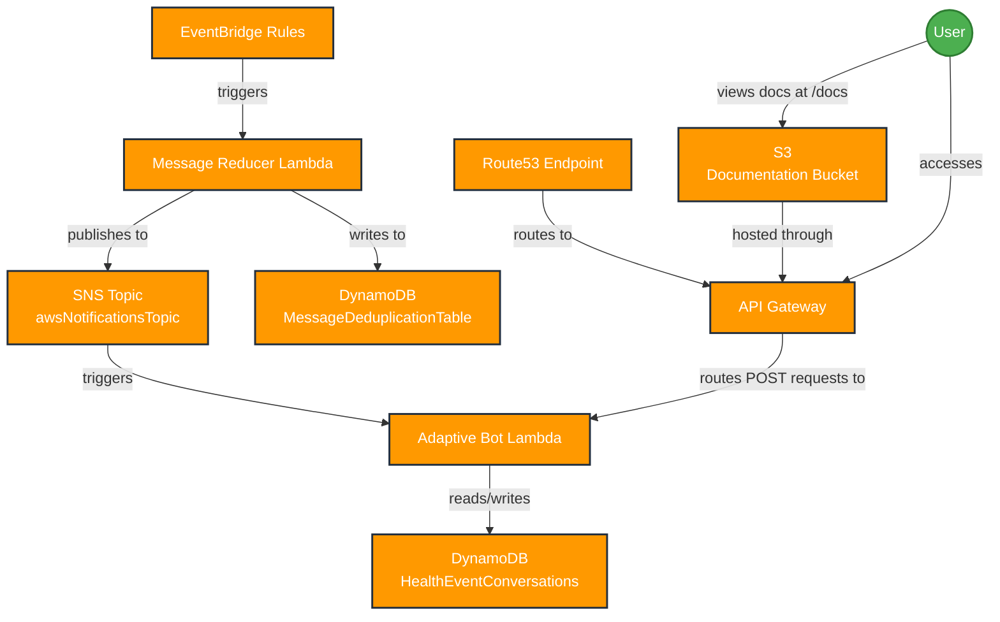

# AWS Bot Lambda Infrastructure Diagram

The diagram below represents the infrastructure components and their relationships deployed by the CDK stack.

## Component Details

- **EventBridge Rules**: Trigger the MessageReducer lambda based on configured AWS service events
- **SNS Topic**: Central messaging service for health notifications with the name "awsNotificationsTopic"
- **DynamoDB Tables**:
  - **MessageDeduplicationTable**: Stores message IDs and timestamps to prevent duplicate processing
  - **HealthEventConversations**: Maintains conversation state for health events
- **Lambda Functions**:
  - **MessageReducer**: Processes incoming events, applies field removal rules, and deduplicates before publishing to SNS
  - **AdaptiveBot**: Processes notifications and manages conversations with the messaging platform
- **API Gateway**: Provides HTTP endpoints for both the bot and documentation access
- **Route53**: DNS configuration for the API Gateway
- **S3 Bucket**: Stores documentation assets accessible via the API Gateway's "/docs" endpoint
