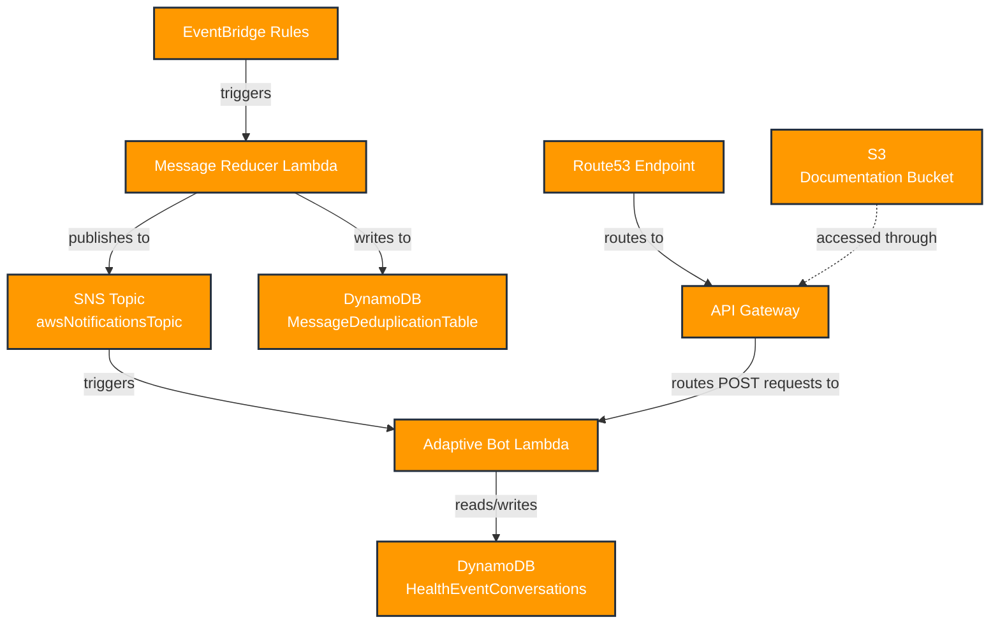

# AWS Bot Lambda Infrastructure Diagram

The diagram below represents the infrastructure components and their relationships deployed by the CDK stack.



## Component Details

- **SNS Topic**: Central messaging service for notifications
- **DynamoDB Tables**:
  - MessageDeduplicationTable: Stores message IDs to prevent duplicate processing
  - HealthEventConversations: Maintains conversation state for health events
- **Lambda Functions**:
  - MessageReducer: Processes incoming events and reduces duplicates before publishing
  - AdaptiveBot: Processes notifications and manages conversations
- **EventBridge Rules**: Trigger the MessageReducer lambda based on configured events
- **API Gateway**: Provides HTTP endpoints for the bot and documentation
- **Route53**: DNS configuration for the API Gateway
- **S3 Bucket**: Stores documentation assets with access controlled through API Gateway
```
