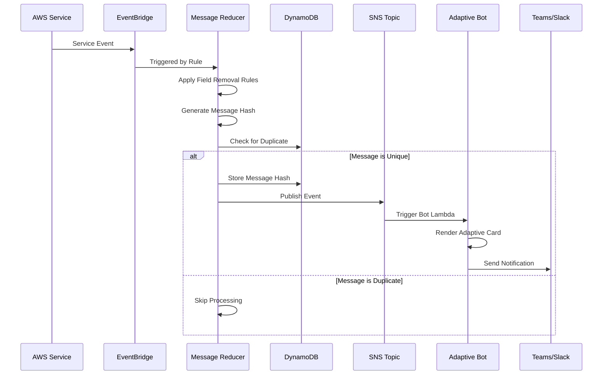
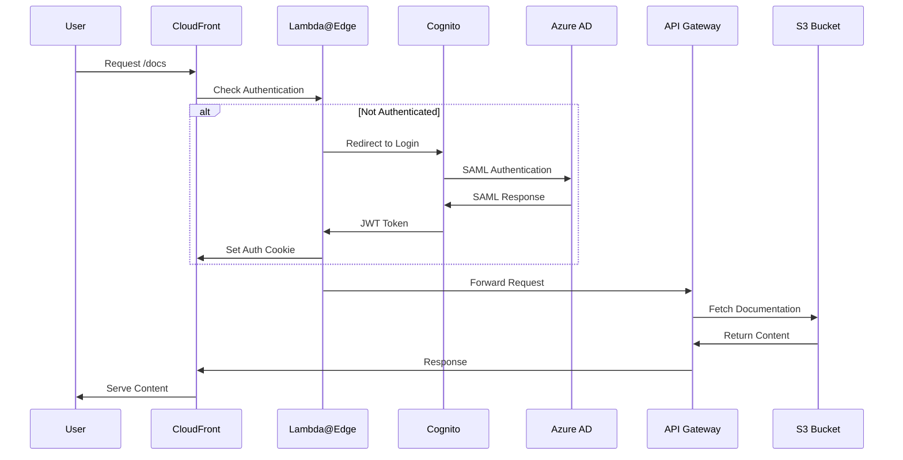
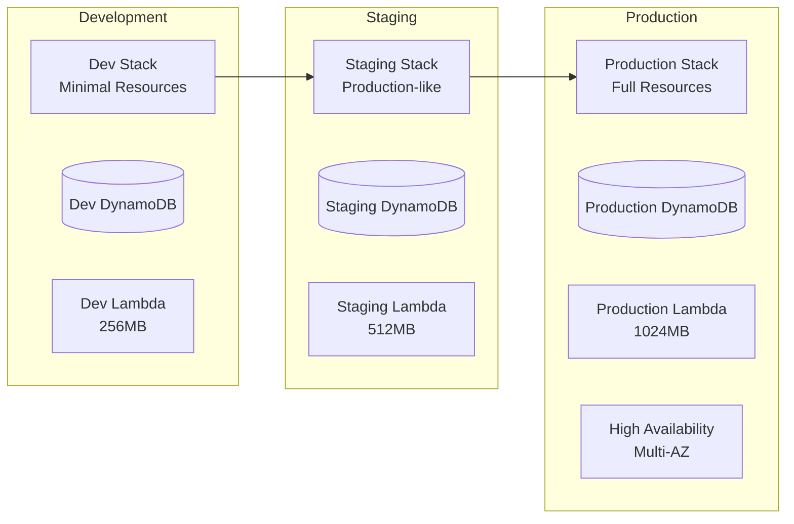

# 🏗️ AWS Bot Lambda Infrastructure Diagram

## Complete System Architecture

This diagram represents the comprehensive infrastructure components and their relationships deployed by the CDK stack.

```mermaid
graph TD
    subgraph "External Systems"
        Teams[Microsoft Teams]
        Slack[Slack]
        JIRA[JIRA]
        Confluence[Confluence]
        PagerDuty[PagerDuty]
        AzureAD[Azure AD]
    end
    
    subgraph "AWS Event Sources"
        EC2Events[EC2 Events]
        SSMEvents[SSM Events]
        HealthEvents[Health Events]
        CWEvents[CloudWatch Events]
        CustomEvents[Custom Events]
    end
    
    subgraph "Event Processing Pipeline"
        EventBridge[EventBridge Rules]
        MsgReducerLambda[Message Reducer Lambda]
        MsgTable[(DynamoDB<br/>MessageDeduplicationTable)]
        SNS[SNS Topic<br/>awsNotificationsTopic]
    end
    
    subgraph "Bot Processing & API"
        BotLambda[Adaptive Bot Lambda]
        ConversationsTable[(DynamoDB<br/>HealthEventConversations)]
        ApiGw[API Gateway]
        Authorizer[Custom Authorizer]
    end
    
    subgraph "Authentication & Authorization"
        Cognito[Cognito User Pool]
        EdgeAuth[Lambda@Edge<br/>Auth Function]
    end
    
    subgraph "Content Delivery"
        CloudFront[CloudFront Distribution]
        Route53[Route53]
        DocBucket[S3 Documentation<br/>Bucket]
        AssetsBucket[S3 Assets<br/>Bucket]
    end
    
    subgraph "Monitoring & Observability"
        CloudWatch[CloudWatch Logs]
        XRay[X-Ray Tracing]
        Alarms[CloudWatch Alarms]
    end
    
    subgraph "Users"
        WebUser((Web User))
        BotUser((Bot User))
    end
    
    %% Event flow
    EC2Events --> EventBridge
    SSMEvents --> EventBridge
    HealthEvents --> EventBridge
    CWEvents --> EventBridge
    CustomEvents --> EventBridge
    
    EventBridge --> MsgReducerLambda
    MsgReducerLambda --> MsgTable
    MsgReducerLambda --> SNS
    SNS --> BotLambda
    
    %% Bot interactions
    Teams --> ApiGw
    Slack --> ApiGw
    BotUser --> Teams
    BotUser --> Slack
    
    %% Bot integrations
    BotLambda --> JIRA
    BotLambda --> Confluence
    BotLambda --> PagerDuty
    BotLambda --> ConversationsTable
    
    %% API flow
    ApiGw --> Authorizer
    Authorizer --> BotLambda
    
    %% Web access flow
    WebUser --> Route53
    Route53 --> CloudFront
    CloudFront --> EdgeAuth
    EdgeAuth --> Cognito
    Cognito --> AzureAD
    EdgeAuth --> ApiGw
    ApiGw --> DocBucket
    CloudFront --> AssetsBucket
    
    %% Monitoring
    BotLambda --> CloudWatch
    MsgReducerLambda --> CloudWatch
    BotLambda --> XRay
    CloudWatch --> Alarms
    
    %% Styling
    classDef aws fill:#FF9900,stroke:#232F3E,color:white,stroke-width:2px;
    classDef external fill:#4285F4,stroke:#1967D2,color:white,stroke-width:2px;
    classDef user fill:#4CAF50,stroke:#2E7D32,color:white,stroke-width:2px;
    classDef storage fill:#9C27B0,stroke:#6A1B9A,color:white,stroke-width:2px;
    
    class EventBridge,SNS,MsgReducerLambda,BotLambda,ApiGw,Route53,CloudFront,Cognito,EdgeAuth,Authorizer,CloudWatch,XRay,Alarms aws;
    class Teams,Slack,JIRA,Confluence,PagerDuty,AzureAD,EC2Events,SSMEvents,HealthEvents,CWEvents,CustomEvents external;
    class WebUser,BotUser user;
    class MsgTable,ConversationsTable,DocBucket,AssetsBucket storage;
```

## Data Flow Diagrams

### Event Processing Flow


```mermaid
sequenceDiagram
    participant AWS as AWS Service
    participant EB as EventBridge
    participant MRL as Message Reducer
    participant DDB as DynamoDB
    participant SNS as SNS Topic
    participant Bot as Adaptive Bot
    participant Teams as Teams/Slack
    
    AWS->>EB: Service Event
    EB->>MRL: Triggered by Rule
    MRL->>MRL: Apply Field Removal Rules
    MRL->>MRL: Generate Message Hash
    MRL->>DDB: Check for Duplicate
    
    alt Message is Unique
        MRL->>DDB: Store Message Hash
        MRL->>SNS: Publish Event
        SNS->>Bot: Trigger Bot Lambda
        Bot->>Bot: Render Adaptive Card
        Bot->>Teams: Send Notification
    else Message is Duplicate
        MRL->>MRL: Skip Processing
    end
```

### Authentication Flow


```mermaid
sequenceDiagram
    participant User as User
    participant CF as CloudFront
    participant Edge as Lambda@Edge
    participant Cognito as Cognito
    participant Azure as Azure AD
    participant API as API Gateway
    participant S3 as S3 Bucket
    
    User->>CF: Request /docs
    CF->>Edge: Check Authentication
    
    alt Not Authenticated
        Edge->>Cognito: Redirect to Login
        Cognito->>Azure: SAML Authentication
        Azure->>Cognito: SAML Response
        Cognito->>Edge: JWT Token
        Edge->>CF: Set Auth Cookie
    end
    
    Edge->>API: Forward Request
    API->>S3: Fetch Documentation
    S3->>API: Return Content
    API->>CF: Response
    CF->>User: Serve Content
```

## Detailed Component Breakdown

### Lambda Functions

#### Message Reducer Lambda
- **Purpose**: Event processing and deduplication
- **Runtime**: Node.js 18.x
- **Memory**: 512MB (configurable by environment)
- **Timeout**: 60 seconds
- **Triggers**: EventBridge rules
- **Dependencies**: DynamoDB, SNS

#### Adaptive Bot Lambda
- **Purpose**: Bot conversation handling and integrations
- **Runtime**: Node.js 18.x
- **Memory**: 1024MB (production)
- **Timeout**: 90 seconds
- **Triggers**: SNS, API Gateway
- **Dependencies**: Teams/Slack APIs, JIRA, PagerDuty

#### Lambda@Edge Auth Function
- **Purpose**: Authentication and authorization at edge
- **Runtime**: Node.js 18.x
- **Memory**: 128MB
- **Timeout**: 5 seconds
- **Triggers**: CloudFront viewer requests

### Storage Components

#### DynamoDB Tables

**MessageDeduplicationTable**
- **Partition Key**: messageId (String)
- **TTL**: timestamp (Number)
- **Billing**: On-demand
- **Encryption**: AWS managed keys

**HealthEventConversations**  
- **Partition Key**: conversationId (String)
- **Sort Key**: timestamp (Number)
- **Global Secondary Indexes**: userId-timestamp-index
- **Billing**: On-demand

#### S3 Buckets

**Documentation Bucket**
- **Purpose**: Host static documentation
- **Access**: Private with IAM roles
- **Encryption**: AES-256
- **Lifecycle**: 90-day deletion policy

**Assets Bucket**
- **Purpose**: Host CSS, JS, images
- **Access**: CloudFront only
- **Encryption**: AES-256
- **CDN**: CloudFront distribution

### Networking & Security

#### API Gateway
- **Type**: REST API
- **Authentication**: Optional Cognito
- **Rate Limiting**: Environment-specific
- **CORS**: Configured for web clients
- **Logging**: CloudWatch integration

#### CloudFront Distribution
- **Purpose**: Global content delivery
- **Origin**: API Gateway + S3 buckets
- **Security**: WAF integration available
- **Caching**: Optimized for static content
- **Compression**: Gzip enabled

#### Cognito User Pool
- **Identity Providers**: Azure AD SAML
- **MFA**: Optional (SMS, TOTP)
- **Groups**: Role-based access control
- **JWT**: Custom claims for permissions

## Infrastructure as Code

### CDK Stack Structure

```
AWS/lib/
├── Notifications.ts              # Main stack
├── apiGateway/
│   ├── endPointApiGateway.ts    # API Gateway config
│   └── docsEndpoint.ts          # Documentation endpoint
├── lambda/
│   ├── adaptiveBot.ts           # Bot Lambda config
│   ├── messageReducer.ts        # Event processor config
│   └── authorizer.ts            # Custom authorizer
├── s3/
│   ├── documentation.ts         # Docs bucket
│   └── assets.ts                # Assets bucket
├── cognito/
│   ├── cognitoAuth.ts          # User pool config
│   └── cloudFrontCognitoLink.ts # CF integration
├── cloudfront/
│   └── rootCloud.ts            # CloudFront setup
├── route53/
│   └── endPoint.ts             # DNS configuration
├── dynamoDb/
│   └── events.ts               # DynamoDB tables
└── eventBridge/
    └── rules.ts                # Event processing rules
```

## Deployment Patterns

### Multi-Environment Architecture


```mermaid
graph LR
    subgraph "Development"
        DevStack[Dev Stack<br/>Minimal Resources]
        DevDB[(Dev DynamoDB)]
        DevLambda[Dev Lambda<br/>256MB]
    end
    
    subgraph "Staging"
        StageStack[Staging Stack<br/>Production-like]
        StageDB[(Staging DynamoDB)]
        StageLambda[Staging Lambda<br/>512MB]
    end
    
    subgraph "Production"
        ProdStack[Production Stack<br/>Full Resources]
        ProdDB[(Production DynamoDB)]
        ProdLambda[Production Lambda<br/>1024MB]
        ProdHA[High Availability<br/>Multi-AZ]
    end
    
    DevStack --> StageStack
    StageStack --> ProdStack
```

For detailed deployment procedures, see the [Deployment Guide](./deployment.md).
